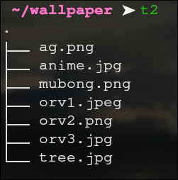
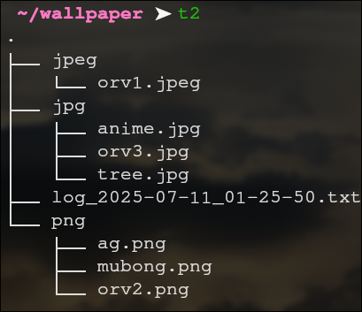

# NOTE: This is my first RUST project :)

# FileOrganizer

FileOrganizer is a command-line tool written in RUST for organizing files withing a directory by their extensions. It also provides the functionality to restore the original structure of the directory using a log file that is created during the organization process.

## Installation and Compilation

1. install rust and cargo
2. clone this repository
3. Build the project:
   ```bash
   cargo build --release
   ```
   The compiled binary will be located in the `target/release` directory.

## How to Run

After compiling the project, the executable can be accessed by using './target/release/FileOrganizer' in the terminal.

### Organizing Files

```bash
./target/release/FileOrganizer -d <directory_path> # change the executable path as needed
```

A log file will be created in the directory that was organized. It contains all the changes made.

### Restoring Original Structure

```bash
./target/release/FileOrganizer -r <log_file_path> # change the executable path as needed
```

## Example

Before:


Organizing:

```bash
➤ ./target/release/FileOrganizer -d ~/wallpaper/
```



Restoring:

```bash
➤ ./target/release/FileOrganizer -r ~/wallpaper/log_2025-07-11_01-25-50.txt
```
